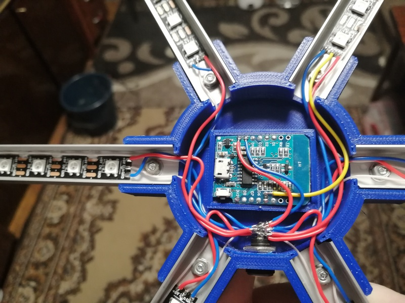

Альтернативный вариант корпуса из П-профиля 15х10 мм от mataor \
https://mysku.ru/blog/diy/89528.html#comment3994465

Колпачки и тройники сидят на универсальном клее момент. Центр на винтах м3х8. Крышка просто защелкивается. Разьем питания 5х2.1 круглый

