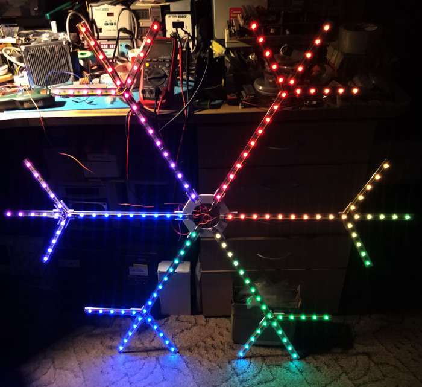

Новогоднее украшение Снежинка
=============================

Новогодняя снежинка из ленты с управляемыми диодами ws2812b.\
http://mysku.ru/

Маленькая снежинка Small_stm32f030
----------------------------------

Video: https://youtu.be/1sG2yrK3HIY

Корпус из 3Д напечатанных деталей. Диаметр 24 см. 31 светодиод. Контроллер stm32f030f4p6. Прошивка написана в Keil.
Код управления лентой взят из [lightshow](http://ebrombaugh.studionebula.com/embedded/lightshow/index.html) авторства E. Brombaugh

Большая снежинка Big_esp8266
----------------------------

https://youtu.be/c78VTL160hA

Корпус из алюминиевых полос 20*2мм, соединители напечатаны на принтере. Диаметр чуть более метра. 150 диодов. ESP8266 в качестве контроллера
(Wi-Fi [пока] не используется). Прошивка написана в PlatformIO, но должна компилироваться и в Arduino IDE.

Зависимости:
* [Arduino core for ESP8266](https://github.com/esp8266/Arduino)
* [FastLED](https://github.com/FastLED/FastLED)

Десктопная версия QTStars
-------------------------

Программа для демонстрации и отладки эффектов на десктопе. Написана в QT Creator, QT 5.7. Откомпилированная под Windows версия в папке release.

### Authors

* **ACE** - [e-mail](mailto:ace@imlazy.ru)
